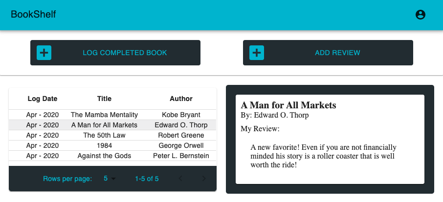
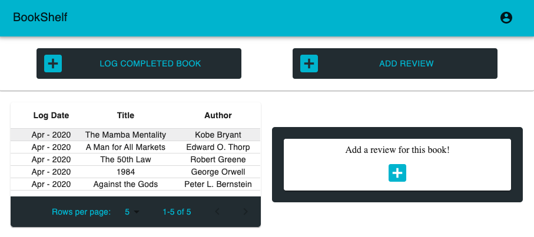
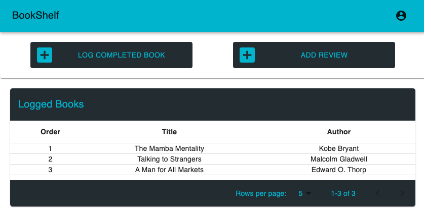
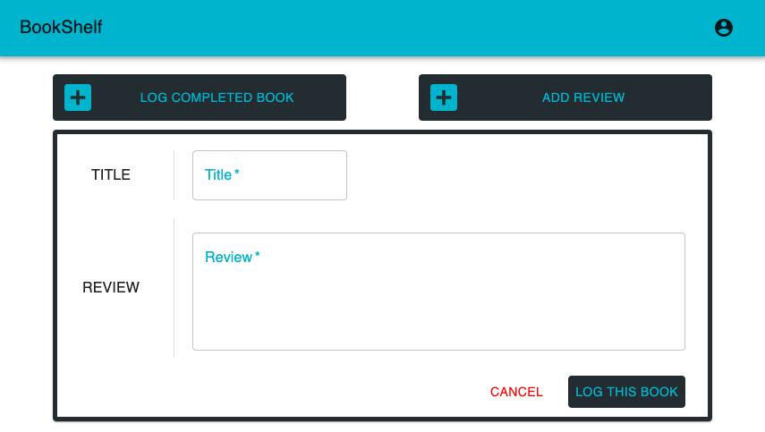
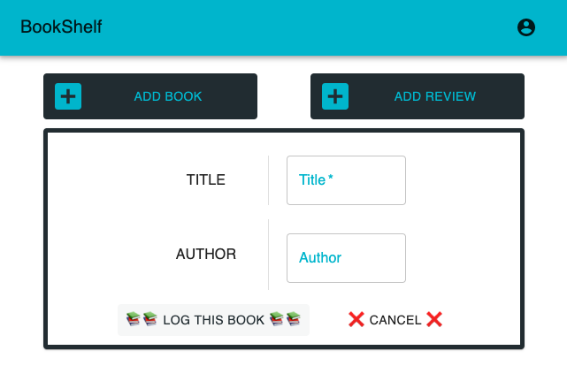
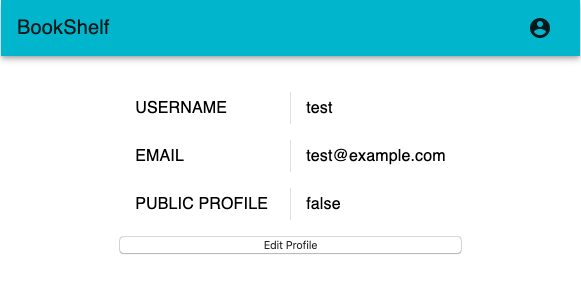
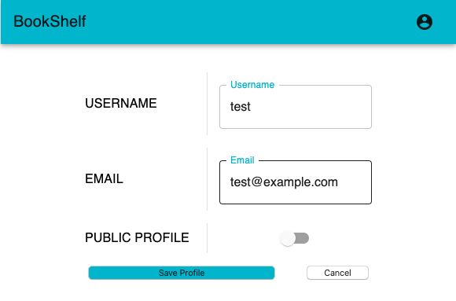
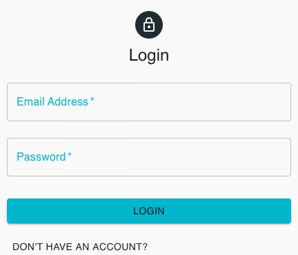
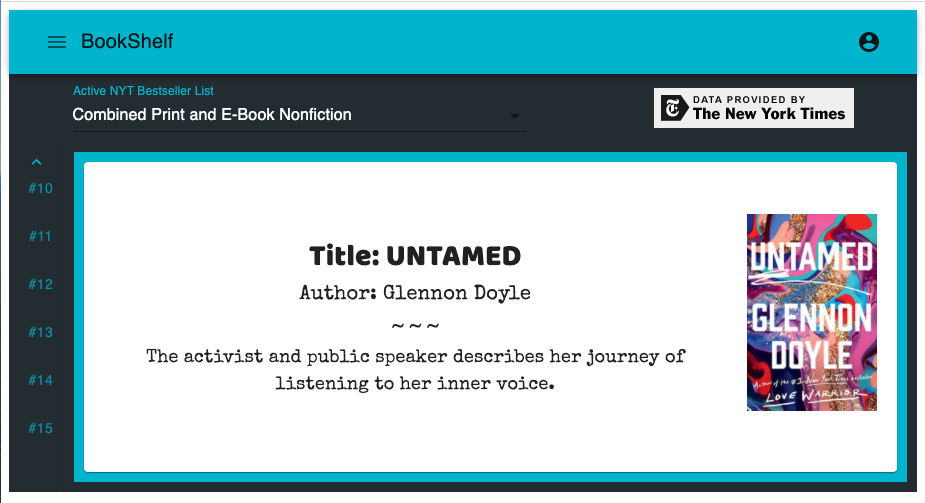
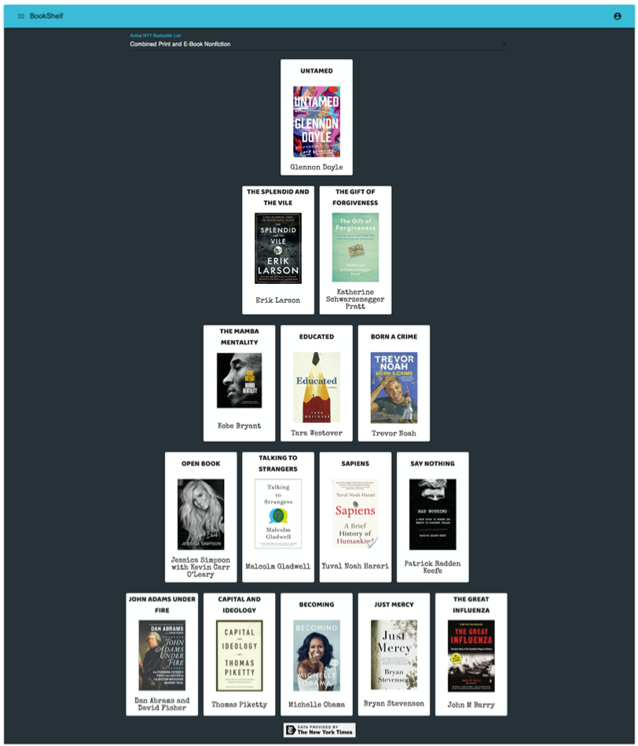

# Welcome to your BookShelf
Your one stop shop for all your reading needs. 

- Visit The Site! 👉🏼👉🏼([LINK](https://my-book-shelf.netlify.com))  

Get a recomendation from a coworker? Log it! 
Just finish a book? Review it! 
Is it a new favorite of yours? Rate it against your yearly and all time rankings & promote it to your friends!
Want to know what another user is reading? Turn your profile 'public' and allow other to interact with you and your BookShelf!

# Tech
## Stack
S - SQL  
E - EXPRESS  
R - React  
N - Node 

## HTTP Client
Axios ([LINK](https://github.com/axios/axios))  

## Query Builder
Knex ([LINK](http://knexjs.org))  

## UI
Material UI ([LINK](https://material-ui.com))  

## Utils
Package Manager: NPM 

## Assets
1. IMG used for favicon: [good-ware](https://www.flaticon.com/authors/good-ware)

## APIs  
- NY Times: Books API ([LINK](https://developer.nytimes.com/docs/books-product/1/overview)) 

    - Get all available book lists:
        - Root URL: https://api.nytimes.com/svc/books/v3/lists/
        - Endpoint: `names.json`
        - Path Parameters: None

    - Get individual list by date
        - Root URL: https://api.nytimes.com/svc/books/v3/lists/
        - Endpoint: `{date}/{list}.json` 
        - Path Parameters:
            - Date: YYYY-MM-DD or "current"
            - List: Name of the Best Sellers List (e.g. hardcover-fiction)  
            
    ** Credit Requirements: https://developer.nytimes.com/branding  

    

## Versions
- Version Numbering System: #.#.#
    - Digit 1 = LTS (long term support)
    - Digit 2 = Feature Release / Security Enhancements
    - Digit 3 = Maitenance Release - smaller improvements to existing features & defect corrections 
---
### Latest: 1.4.2 -- Profile Page Functionality Update

1.4.2 -- Visualize User Reviews

- Card that shows the users most revent review for that book

Screenshot:   
     
     

1.4.1 -- Visualize User Logs

- Table that shows all of the users logged books
- Table columns are sortable 

Screenshot:   
   

1.4.0 -- Profile Page Functionality Update

- Add Review for a book & styling update  

Screenshot:  
  
  

1.3.1: Profile Page Functionality Update: Log Completed Book

- Single user flow => 
    - title input entry searching DB
        - Title in DB
            - no author entry
            - log type === 'logOnly'
        - Title NOT in DB
            - author entry needed
            - log type === 'addAndLog'

    - adds book to DB if needed
    - adds entry to readHistory

Screenshot:  
  

1.3.0 - HOTFIX: login

- Add book to DB
- Login Hotfix -- forced premature merge

1.2.0 - Account Page: Update profile

1. Username
2. Email
3. Public Profile

Screenshots:  
  
  

1.1.0 - Sign in as guest

- FE
    - Button added to <login /> so user can login as a guest
    - <Loader /> color & position updated
    - <Homepage /> linking to 'helloWorld' <AccountPage />
- BE 
    - User privilages added to users table

1.0.0 - HOSTED: Register & Login

- FE: Hosted  
    - Login & Register  
    - Homepage - Vert Tabs - NYT Bestseller List  

- BE: Hosted
    - Login & Register both setting token on Redux store -> login & register 1 step to homepage

Screenshots:  
  
  

0.1.1 - Homepage Redesign: Material UI Vertical Tabs

- FE: Hosted Homepage - Material UI Vertical Tabs - NYT Bestseller List Explorer 
- BE: Login & Register functionality working in postman but not hooked up to FE

Screenshot:  
  

  

0.1.0 - Homepage: Pyramid

- FE: Hosted Homepage - Desktop Only - NYT Bestseller List Pyramid
- BE: Login & Register functionality working in postman but not hooked up to FE

Screenshot:  
  

  
   

---  
Author: Reed Turgeon