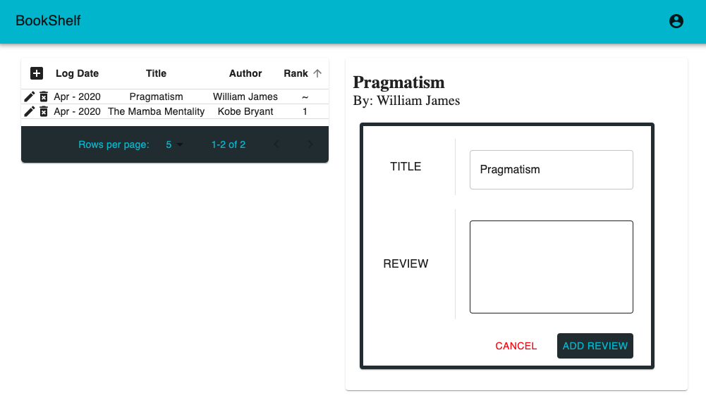
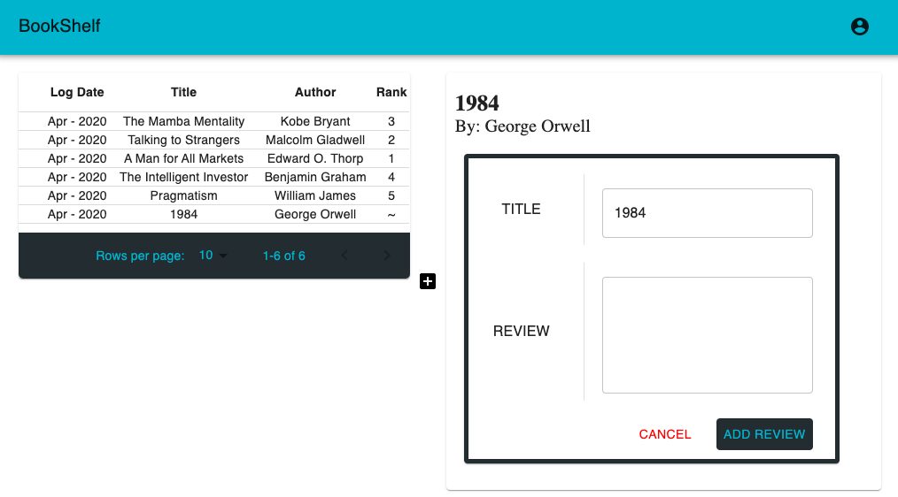
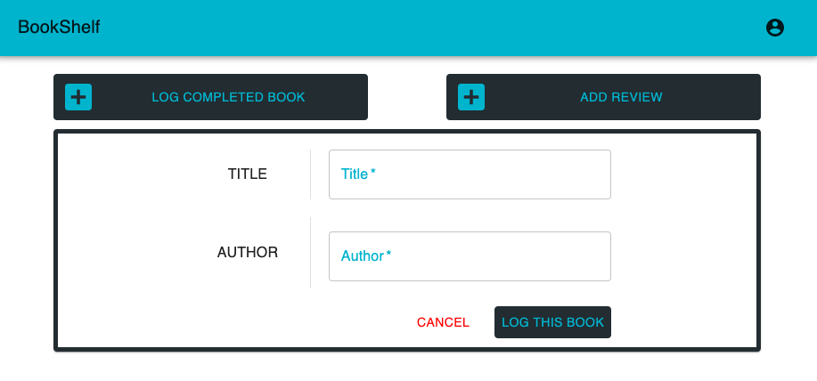
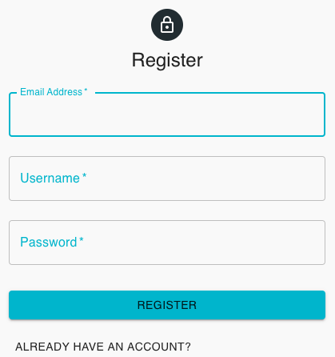

# Welcome to your BookShelf
Your one stop shop for all your reading needs. 

- Visit The Site! 👉🏼👉🏼 ([LINK](https://my-book-shelf.netlify.com))  
- API Documentation: ([Postman Documenter](https://documenter.getpostman.com/view/10122836/Szf54pe1?version=latest))

# Tech Stack
| title                   | name                                    | link                                                                             |
| ---                     | ---                                     | ---                                                                              | 
| Database                | S: SQL - Postgres                       | [LINK](https://www.postgresql.org)                                               |
| Server                  | E: Express                              | [LINK](https://expressjs.com)                                                    |
| UI Component Library    | R: React                                | [LINK](https://reactjs.org)                                                      |
| Server Run Time         | N: NodeJS                               | [LINK](https://nodejs.org/en/)                                                   |
| --- --- ---             | --- --- ---                             | --- --- ---                                                                      | 
| Package Manage          | NPM                                     | [LINK](https://nodejs.org/en/)                                                   |
| --- --- ---             | --- --- ---                             | --- --- ---                                                                      | 
| HTTP Client             | Axios                                   | [LINK](https://github.com/axios/axios)                                           |
| Query Builder           | Knex (prioritized used of .raw(``))     | [LINK](http://knexjs.org)                                                        |
| Styling                 | Material UI                             | [LINK](https://material-ui.com)                                                  |
| --- --- ---             | --- --- ---                             | --- --- ---                                                                      | 
| API Integration Testing | SuperTest & Jest                        | [SuperTest](https://www.npmjs.com/package/supertest) / [Jest](https://jestjs.io) |
| Unit Testing            | Jest                                    | [LINK](https://jestjs.io)                                                        | 
| End to End Testing      | Cypress                                 | [LINK](https://www.cypress.io)

## APIs  
- NY Times: Books API ([LINK](https://developer.nytimes.com/docs/books-product/1/overview)) 

    - Get all available book lists:
        - Root URL: https://api.nytimes.com/svc/books/v3/lists/
        - Endpoint: `names.json`
        - Path Parameters: None

    - Get individual list by date
        - Root URL: https://api.nytimes.com/svc/books/v3/lists/
        - Endpoint: `{date}/{list}.json` 
        - Path Parameters:
            - Date: YYYY-MM-DD or "current"
            - List: Name of the Best Sellers List (e.g. hardcover-fiction)  
            
    ** NYT API Credit Requirements: [LINK](https://developer.nytimes.com/branding  )

    

## Credit
| title         | notes                    | link                                                                |
| ------------- | ------------------------ | ------------------------------------------------------------------- |
| favicon       | Author: Good Ware        | [LINK](https://www.flaticon.com/authors/good-ware)                  |
| Books API     | Title: NYT Books API     | [LINK](https://developer.nytimes.com/docs/books-product/1/overview) |

## Versions -- Latest: 1.6.1

1.6.1 -- Individual Log Exploration & Log Interactions Update

1. Updates to accessing data from redux store and app data flow
2. <UserLogTable /> now holds the ability to add a log while individual table rows hode the ability to toggle editing an individual log or delete the individual log (delete cascades to Reviews & Ranks tables)
3. <ExploreSelectedLogID /> rebuilt subComponents to match new dataflow after <UserLogTable /> built. Individual subcomponents can (based on the state of the current selected log) either add a Rank or add a Review to a log

Screenshot:   
   

     
   
   

1.6.0 -- Profile Page Overhaul / Functionality Update & DB Redesign

- Complete Redesign of < Profile /> => new data flow and component structure  
- Profile Page Overhaul / Functionality Update  
    1. Log Book (existing book in BD or add new book work in one user flow)
    2. User Logs Table (Log Date / Title / Author / Rank => ALL columns sortable)
    3. Selected Log Explorer (Click on User Logs Table loads all LogID data in separate component)
    4. Add / Update Rank for selected log
    5. Add / Update Review for selected log
- DB Redesign
    - User Logs are now the folcrum. You cannot add a review or rank without first having a logID in the system (aka: you actually read the book). Other tables columns stripped to only essential (non-repeated) data and linked with foreign key migrations.   

Screenshot:   
        
        
        
        

1.5.0 -- Initial API Integration Testing

- End to End Testing - Cypress
    - Guest Login 

- API Integration Testing - JEST
    - TODO: Users
        - ✅ Routes & Models Separated
        - ✅ Integration Testing: Models & Routes 
            - beforeEach() => truncate USERS table
            1. Get /users/all
            2. Put /users/:userID
            3. Del /users/:userID

    - TODO: Books
        - ✅ Routes & Models Separated
        - ✅ Integration Testing: Models & Routes 
            - beforeEach() => truncate BOOKS table
            1. Post /books/
            2. Get /books/all
            3. Get /books/:bookID
            4. Put /books/:bookID
            5. Del /books/:bookID
            
    - TODO: Reviews
        - ✅ Routes & Models Separated
        - ✅ Integration Testing: Models & Routes 
            - beforeEach() => truncate REVIEWS / BOOKS / USERS table
            1. Post /reviews/
            2. Get /reviews/all
            3. Get /reviews/singleReview/:reviewID
            4. Get /reviews/singleBook/:bookID
            5. Get /reviews/singleUser/:userID
            6. Put /reviews/:reviewID
            7. Del /reviews/:reviewID

    - TODO: Logs
        - ✅ Routes & Models Separated
        - ✅ Integration Testing: Models & Routes 
            - beforeEach() => truncate COMPLETEDBOOKS / BOOKS / USERS table
            1. Post /logs/
            2. Get /logs/all
            3. Get /logs/:singleUser/:userID
            4. Get /logs/:singleBook/:bookID
            5. Get /logs/:singleLog/:logID
            6. Del /logs/:logID

    - TODO: Register
        - ✅ Routes & Models Separated
        - ✅ Integration Testing: Models & Routes
            - beforeEach() => truncate USERS table
            1. Post /register/

    - TODO: Login
        - ✅ Routes & Models Separated
        - ✅ Integration Testing: Models & Routes
            - beforeEach() => truncate USERS table
            1. Post /login/

1.4.2 -- Visualize User Reviews

- Card that shows the users most revent review for that book

Screenshot:   
     
     

1.4.1 -- Visualize User Logs

- Table that shows all of the users logged books
- Table columns are sortable 

Screenshot:   
   

1.4.0 -- Profile Page Functionality Update

- Add Review for a book & styling update  

Screenshot:  
  
  

1.3.1 -- Profile Page Functionality Update

- Log completed Book

- Single user flow => 
    - title input entry searching DB
        - Title in DB
            - no author entry
            - log type === 'logOnly'
        - Title NOT in DB
            - author entry needed
            - log type === 'addAndLog'

    - adds book to DB if needed
    - adds entry to readHistory

Screenshot:  
  

1.3.0 -- HOTFIX: login

- Add book to DB
- Login Hotfix - forced premature merge

1.2.0 -- Account Page: Update profile

1. Username
2. Email
3. Public Profile

Screenshots:  
  
  

1.1.0 -- Sign in as guest

- FE
    - Button added to <login /> so user can login as a guest
    - <Loader /> color & position updated
    - <Homepage /> linking to 'helloWorld' <AccountPage />
- BE 
    - User privilages added to users table

1.0.0 -- HOSTED: Register & Login

- FE: Hosted  
    - Login & Register  
    - Homepage - Vert Tabs - NYT Bestseller List  

- BE: Hosted
    - Login & Register both setting token on Redux store -> login & register 1 step to homepage

Screenshots:  
  
  

0.1.1 -- Homepage Redesign: Material UI Vertical Tabs

- FE: Hosted Homepage - Material UI Vertical Tabs - NYT Bestseller List Explorer 
- BE: Login & Register functionality working in postman but not hooked up to FE

Screenshot:  
  

  

0.1.0 -- Homepage: Pyramid

- FE: Hosted Homepage - Desktop Only - NYT Bestseller List Pyramid
- BE: Login & Register functionality working in postman but not hooked up to FE

Screenshot:  
  

  
   

---  
Author: Reed Turgeon